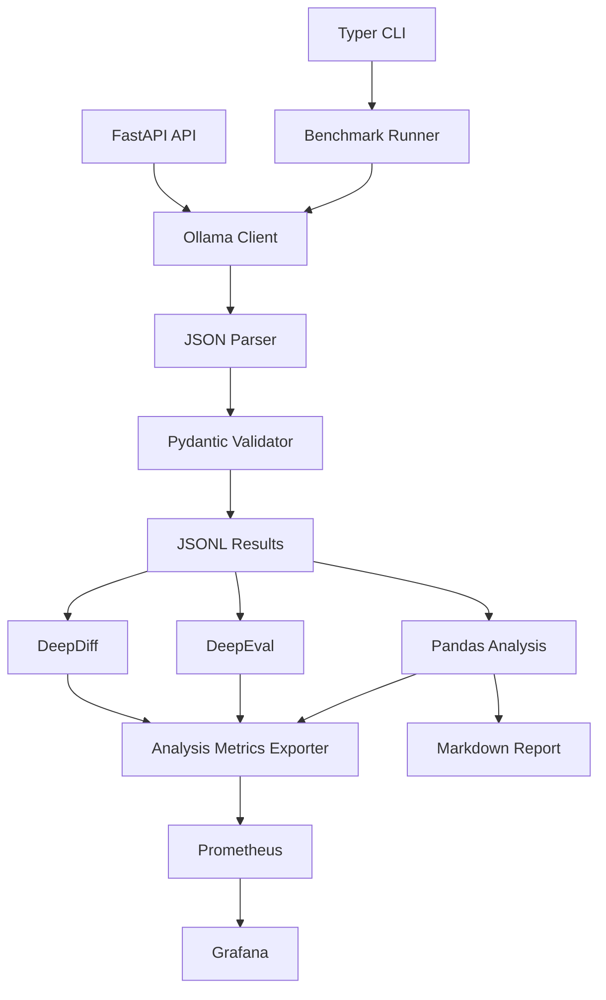

# Local SLM Benchmarking Implementation Plan

## Approach
Build this as a Python package following [`REQUIREMENTS.md`](e:/AI-Workstuff/Projects/Benchmarking/REQUIREMENTS.md), with a Typer CLI as the main execution path and FastAPI as the local service wrapper. The implementation should work in a lightweight local mode first, then run the full benchmark matrix on a more powerful machine without path or machine-specific assumptions.

## Phase 1: Project Scaffold And Configuration
- Create the Python package structure under `src/local_slm_benchmark/`.
- Add `pyproject.toml` with the chosen stack: FastAPI, Typer, Pydantic, pytest-benchmark, psutil, pandas, rich, DeepDiff, OpenTelemetry, Prometheus client, structlog, DeepEval, and Matplotlib.
- Add portable config files under `config/` for model names, Ollama host, temperatures, retries, output paths, and benchmark settings.
- Add a small `prompts/benchmark_prompts.json` seed prompt set for smoke testing before the 30-50 prompt set is finalized.

## Phase 2: Ollama Generation And Baseline CLI
- Implement `models/ollama_client.py` for local Ollama generation, including streaming support where possible.
- Implement timing capture for time to first token, total latency, approximate output tokens, and tokens per second.
- Implement `cli/main.py` with commands for environment inspection, single-prompt generation, prompt validation, and a small benchmark run.
- Persist raw benchmark rows to `results/` as JSONL first, because it is append-friendly and easy to inspect.

## Phase 3: Structured JSON Validation And Retry
- Define Pydantic request, response, prompt, and benchmark result schemas in `models/schemas.py`.
- Implement `validation/parser.py` to extract and parse JSON-only model output.
- Implement `validation/retry.py` for correction prompts when JSON parsing or Pydantic validation fails.
- Capture validation status, validation errors, retry count, and final failure reason in every benchmark result.

## Phase 4: Benchmark Matrix Runner
- Implement `benchmark/runner.py` to execute `models x temperatures x prompts x repeat_count`.
- Implement `benchmark/system.py` using psutil for CPU and memory capture.
- Add Rich progress output and concise CLI summaries.
- Add focused tests for schema validation, retry behavior, prompt loading, and benchmark result serialization.

## Phase 5: FastAPI Service And Metrics Endpoint
- Implement `api/app.py` and `api/routes.py` with `GET /health`, `POST /generate`, and `GET /metrics`.
- Keep FastAPI generation behavior shared with the CLI instead of duplicating model logic.
- Expose Prometheus-compatible runtime metrics for latency, time to first token, tokens per second, retries, validation failures, and benchmark run counts.

## Phase 6: Observability
- Implement `observability/logging.py` with structlog JSON logs.
- Implement `observability/tracing.py` for OpenTelemetry spans around benchmark runs, Ollama generation, validation, retries, persistence, and evaluation.
- Implement `observability/metrics.py` for runtime Prometheus metrics.
- Add `dashboards/prometheus.yml` and `dashboards/grafana-dashboard.json` for live benchmark panels.

## Phase 7: Evaluation, Aggregation, And Analysis Metrics Export
- Implement `evaluation/diff.py` with DeepDiff comparisons for repeated runs and temperature variance.
- Implement `evaluation/deepeval_runner.py` with a small custom rubric path first, then optional DeepEval integration for richer scoring.
- Implement `reporting/analysis.py` with pandas aggregation for averages, p95 latency, JSON success rate, retry rate, throughput, memory, quality, and variance.
- Implement `observability/analysis_exporter.py` to publish post-run analysis metrics such as `slm_quality_score`, `slm_output_variance_score`, `slm_json_validation_success_rate`, `slm_retry_rate`, `slm_p95_latency_ms`, and `slm_average_tokens_per_second` to Prometheus.

## Phase 8: Reporting
- Implement `reporting/report.py` to generate a Markdown report and Matplotlib charts under `reports/`.
- Include hardware/environment details, model configuration, methodology, latency, throughput, memory, JSON reliability, determinism, quality evaluation, recommendation, and limitations.
- Ensure report generation can run from saved results without rerunning models.

## Validation Strategy
- Unit tests for schema validation, JSON parsing, retry prompt construction, result serialization, and pandas aggregation.
- Smoke test with one model, one temperature, and 2-3 prompts.
- Full test on the powerful machine with three models, two temperatures, 30-50 prompts, and repeat runs.

## Target Data Flow

## First Milestone
The first useful milestone should be a runnable local smoke benchmark: one Ollama model, a tiny prompt file, JSON validation, basic timing metrics, JSONL result output, and a CLI summary. That gives us a working spine before adding dashboards and richer evaluation.