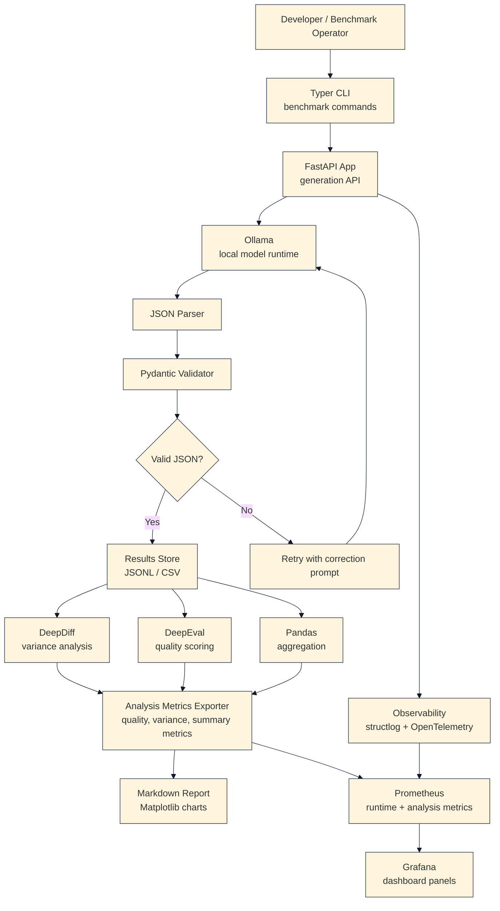
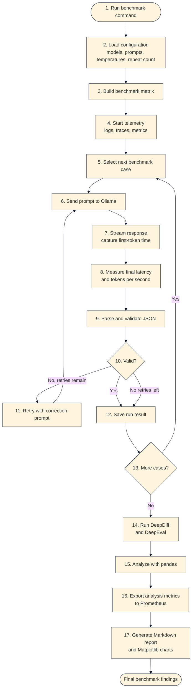
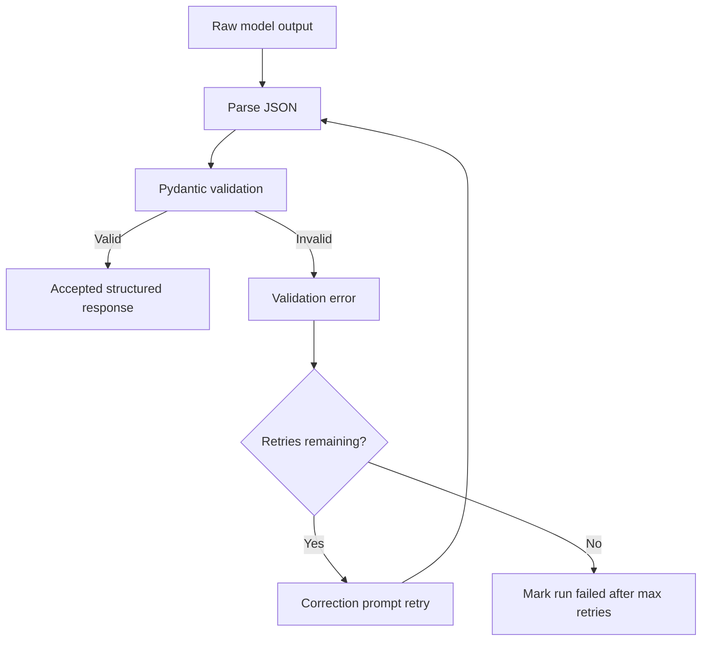

# Local SLM Benchmarking Assistant - Requirements

## 1. Project Purpose

This project builds a local AI assistant powered by Small Language Models (SLMs) and evaluates it like an engineering system, not just a chatbot demo.

The goal is to demonstrate practical maturity around:

- Local/private model execution
- Latency and throughput measurement
- Hardware-aware benchmarking
- Structured model output
- JSON schema validation and retry behavior
- Determinism testing across temperatures
- Model comparison across speed, memory, reliability, and quality
- Observability using traces, metrics, logs, and dashboards
- Clear technical reporting

The project should be developed locally first, then run on a more powerful machine for final benchmark collection.

## 2. What We Are Trying To Achieve

The system should allow us to run the same benchmark prompt set across multiple local models and configurations, collect consistent performance and quality metrics, and produce a technical report comparing the results.

At the end of the project, we should be able to answer:

- Which local model is fastest on the target hardware?
- Which model has the best time to first token?
- Which model provides the best tokens-per-second throughput?
- Which model produces the most reliable structured JSON?
- How often does each model require retries?
- How does temperature affect determinism and output variance?
- What is the speed vs. quality tradeoff across models?
- What memory and CPU usage does each model require?
- Which model/configuration is the best practical choice for a local assistant?

## 3. In Scope

- Local model execution through Ollama
- Python application code
- FastAPI service wrapper for assistant generation and metrics endpoints
- Typer CLI for benchmark orchestration
- Pydantic schemas for response validation
- Retry logic for invalid structured responses
- Benchmarking of latency, throughput, and memory usage
- Structured logging
- OpenTelemetry instrumentation
- Prometheus metrics export
- Grafana dashboard support
- DeepDiff-based output comparison
- DeepEval-based quality evaluation
- Pandas-based analysis
- Markdown report generation
- Matplotlib charts

## 4. Out Of Scope For Now

- RAG evaluation with Ragas
- Cloud-hosted model providers as the primary path
- Multi-user authentication
- Long-term conversation memory
- Production deployment
- Fine-tuning models
- Vector database integration
- Agentic tool execution

Ragas may be reconsidered later if the project adds retrieval-augmented generation.

## 5. Planned Technology Stack

### Model Runtime

- Ollama: local model serving
- Candidate models: Llama 3.2 3B, Mistral 7B, Phi-family model, or similar 3B-7B local SLMs
- Optional later extension: quantized variants such as Q4 and Q5

### Application Layer

- Python: main implementation language
- FastAPI: local API wrapper around generation and metrics endpoints
- Typer: CLI interface for benchmark runs and report generation

### Validation And Reliability

- Pydantic: response schemas and validation
- JSON: required model response format
- Retry/re-prompt loop: correct invalid model outputs before failing
- DeepDiff: compare structured outputs across models, temperatures, and repeat runs

### Benchmarking And System Metrics

- pytest-benchmark: repeatable performance measurement support
- psutil: CPU and memory usage collection
- pandas: result aggregation and analysis
- rich: readable CLI output, progress indicators, and local result summaries

### Observability

- OpenTelemetry: traces and metrics instrumentation
- Prometheus: metrics scraping and time-series storage
- Grafana: dashboard visualization
- structlog: structured application logs

### Evaluation

- DeepEval: quality scoring and custom evaluation metrics

Ragas is intentionally excluded for the initial version because this project is not currently a RAG system.

### Reporting

- Markdown: final technical report
- Matplotlib: charts for latency, throughput, memory, validation rate, and quality comparison

## 6. Cross-Machine Compatibility

The code should be written so it can be generated and developed on one machine, then executed on a more powerful machine later.

The implementation should avoid hardcoded machine-specific assumptions:

- Do not hardcode absolute paths.
- Use environment variables or config files for runtime settings.
- Keep model names configurable.
- Keep benchmark prompt files portable.
- Store results in project-relative directories.
- Document Ollama model installation separately from Python dependency installation.

The stack is broadly cross-platform across Windows, Linux, and macOS, but final performance numbers will depend heavily on:

- CPU model
- GPU availability
- RAM and VRAM
- Ollama backend behavior
- Model size and quantization
- Background system load

## 7. High-Level Architecture



The dashboard path is intentional: runtime metrics are sent to Prometheus during generation, and post-run analysis metrics from DeepDiff, DeepEval, and pandas are exported to Prometheus after evaluation. Grafana can then show both live benchmark behavior and final model comparison summaries.

## 8. Execution Flow



## 9. Runtime Components

### Typer CLI

The CLI is the main benchmark control surface.

Expected commands:

- Run benchmark matrix
- Run a single prompt against one model
- Validate prompt files
- Generate reports from saved results
- Print local environment/system info

Example future command shape:

```bash
python -m app benchmark run \
  --models llama3.2:3b mistral:7b phi4 \
  --temperatures 0 0.7 \
  --prompts prompts/benchmark_prompts.json \
  --runs-per-prompt 3
```

### FastAPI Service

FastAPI provides a local assistant API and keeps the generation behavior testable outside the CLI.

Expected endpoints:

- `GET /health`: service health check
- `POST /generate`: single generation request
- `POST /benchmark/run`: optional API-triggered benchmark run
- `GET /metrics`: Prometheus-compatible metrics endpoint

### Ollama Client

The Ollama integration sends prompts to local models and captures streaming output.

It should measure:

- Time to first token
- Total response latency
- Approximate output token count
- Tokens per second
- Model name
- Temperature
- Retry count

### Validation Layer

The validation layer enforces structured JSON output.

Flow:



### Benchmark Result Store

Each run should produce a structured record.

Example result shape:

```json
{
  "run_id": "2026-04-25T180000Z-001",
  "prompt_id": "summarize_001",
  "model": "llama3.2:3b",
  "temperature": 0,
  "attempt": 1,
  "time_to_first_token_ms": 420,
  "total_latency_ms": 3100,
  "output_tokens": 120,
  "tokens_per_second": 38.7,
  "valid_json": true,
  "retry_count": 0,
  "cpu_percent": 62.5,
  "memory_mb": 8120,
  "quality_score": null,
  "error": null
}
```

## 10. Proposed Project Structure

```text
.
├── README.md
├── REQUIREMENTS.md
├── pyproject.toml
├── .env.example
├── config/
│   ├── models.yaml
│   └── benchmark.yaml
├── prompts/
│   └── benchmark_prompts.json
├── src/
│   └── local_slm_benchmark/
│       ├── __init__.py
│       ├── api/
│       │   ├── app.py
│       │   └── routes.py
│       ├── cli/
│       │   └── main.py
│       ├── benchmark/
│       │   ├── runner.py
│       │   ├── metrics.py
│       │   └── system.py
│       ├── models/
│       │   ├── ollama_client.py
│       │   └── schemas.py
│       ├── validation/
│       │   ├── parser.py
│       │   └── retry.py
│       ├── evaluation/
│       │   ├── deepeval_runner.py
│       │   └── diff.py
│       ├── observability/
│       │   ├── logging.py
│       │   ├── metrics.py
│       │   ├── analysis_exporter.py
│       │   └── tracing.py
│       └── reporting/
│           ├── analysis.py
│           └── report.py
├── tests/
│   ├── test_validation.py
│   ├── test_benchmark_runner.py
│   └── test_schemas.py
├── results/
│   └── .gitkeep
├── reports/
│   └── .gitkeep
└── dashboards/
    ├── prometheus.yml
    └── grafana-dashboard.json
```

This structure is a target implementation shape. It can be simplified during implementation if the first version does not need every module immediately.

## 11. Benchmark Matrix

The benchmark runner should support a configurable matrix:

```text
models x temperatures x prompts x repeat_count
```

Initial target:

- 3 local models
- 2 temperature settings: `0` and `0.7`
- 30-50 benchmark prompts
- 3 repeat runs per prompt/configuration

Example total run count:

```text
3 models x 2 temperatures x 40 prompts x 3 repeats = 720 generations
```

## 12. Metrics To Capture

### Performance Metrics

- Time to first token
- Total latency
- Output tokens
- Tokens per second
- Retry latency
- End-to-end benchmark duration

### Reliability Metrics

- JSON parse success rate
- Pydantic validation success rate
- Retry count
- Retry success rate
- Final failure rate
- Schema error categories

### System Metrics

- CPU usage
- Memory usage
- Optional GPU/VRAM usage if available later
- Model name and size
- Quantization level if applicable

### Quality Metrics

- DeepEval score
- Custom rubric score
- Completeness
- Correctness
- Relevance
- Instruction following

### Determinism Metrics

- Output variance across repeated runs
- DeepDiff distance between structured outputs
- Difference between temperature `0` and `0.7`

## 13. Observability Design

Each prompt run should create a trace with spans similar to:

```text
benchmark.run
  -> prompt.load
  -> ollama.generate
  -> stream.first_token
  -> response.validate
  -> retry.correct_invalid_json
  -> result.persist
  -> evaluation.score
```

Useful span attributes:

- `model.name`
- `model.temperature`
- `prompt.id`
- `prompt.category`
- `benchmark.run_id`
- `response.valid_json`
- `response.retry_count`
- `response.output_tokens`
- `latency.time_to_first_token_ms`
- `latency.total_ms`

Prometheus should expose aggregate metrics such as:

- `slm_generation_latency_ms`
- `slm_time_to_first_token_ms`
- `slm_tokens_per_second`
- `slm_json_validation_failures_total`
- `slm_retries_total`
- `slm_benchmark_runs_total`

The project should also export post-run analysis metrics to Prometheus after DeepDiff, DeepEval, and pandas aggregation complete. These metrics make Grafana useful for both live benchmark monitoring and final model comparison dashboards.

Analysis metrics should include:

- `slm_quality_score`
- `slm_output_variance_score`
- `slm_json_validation_success_rate`
- `slm_retry_rate`
- `slm_average_latency_ms`
- `slm_p95_latency_ms`
- `slm_average_tokens_per_second`
- `slm_average_memory_mb`

These analysis metrics should include labels such as:

- `model`
- `temperature`
- `prompt_category`
- `run_id`
- `quantization`, if available

Grafana should visualize both metric groups:

- Runtime dashboard: current benchmark progress, latency, time to first token, tokens per second, retries, validation failures, CPU, and memory.
- Analysis dashboard: quality score by model, output variance by temperature, JSON success rate, retry rate, p95 latency, throughput, memory usage, and quality-vs-latency comparison.

structlog should emit structured JSON logs for benchmark start, generation completion, validation failure, retry, and run completion.

## 14. Evaluation Strategy

Evaluation should combine deterministic, structural, and quality-oriented checks.

### Structural Checks

- Valid JSON
- Required fields present
- Field types match schema
- No extra prose outside JSON

### Determinism Checks

- Compare repeated runs for the same model, prompt, and temperature.
- Use DeepDiff to identify changed fields.
- Summarize variance by model and temperature.

### Quality Checks

Use DeepEval for selected quality metrics and custom scoring.

Initial scoring dimensions:

- Correctness
- Relevance
- Completeness
- Instruction following
- Conciseness

If a judge model is required, prefer documenting whether the judge is local or cloud-based because that affects the privacy story.

## 15. Report Requirements

The final report should be generated as Markdown and include charts from Matplotlib.

Required report sections:

- Executive summary
- Hardware and environment description
- Model list and configuration
- Prompt set description
- Benchmark methodology
- Latency comparison
- Throughput comparison
- Memory usage comparison
- JSON reliability comparison
- Temperature/determinism analysis
- Quality evaluation summary
- Recommended model/configuration
- Limitations and next steps

Expected charts:

- Average latency by model
- P95 latency by model
- Time to first token by model
- Tokens per second by model
- JSON validation success rate
- Retry rate by model
- Quality score vs. latency
- Memory usage by model

## 16. Implementation Phases

### Phase 1: Local Generation And Baseline Benchmarking

- Set up Python project
- Add Ollama client
- Add simple CLI command
- Run one model against a small prompt set
- Capture latency and tokens-per-second metrics
- Save results to JSONL or CSV

### Phase 2: Structured Output And Validation

- Define Pydantic response schemas
- Require JSON-only model responses
- Add parser and validation logic
- Add retry/re-prompt logic
- Track validation failures and retry counts

### Phase 3: Benchmark Matrix

- Add configurable model list
- Add configurable temperatures
- Add repeat runs
- Add psutil system metrics
- Add rich CLI summaries
- Save complete structured results

### Phase 4: Observability

- Add structlog
- Add OpenTelemetry traces
- Add Prometheus metrics endpoint
- Add Grafana dashboard configuration
- Add dashboard panels for live runtime metrics

### Phase 5: Evaluation And Reporting

- Add DeepDiff comparison
- Add DeepEval quality scoring
- Add pandas analysis
- Export DeepDiff, DeepEval, and pandas summary metrics to Prometheus
- Add Grafana dashboard panels for post-run analysis metrics
- Generate Markdown report
- Generate Matplotlib charts

## 17. Success Criteria

The project is successful when:

- At least three local models can be benchmarked on the same prompt set.
- Each run records time to first token, total latency, tokens per second, memory usage, validation result, and retry count.
- Structured JSON responses are validated with Pydantic.
- Invalid responses are retried and tracked.
- Temperature `0` and `0.7` runs can be compared for variance.
- Results are persisted in a reusable format.
- A final Markdown report with charts can be generated.
- Prometheus/Grafana can show live benchmark metrics.
- Prometheus/Grafana can show post-run analysis metrics from DeepDiff, DeepEval, and pandas aggregation.
- The project can be developed on one machine and executed on another with minimal configuration changes.

## 18. Key Design Decisions

- Use Typer as the primary benchmark runner because benchmark work should be repeatable from the command line.
- Use FastAPI as a service wrapper so the assistant can be tested as an application, not only as scripts.
- Use Pydantic for schema enforcement because structured output reliability is a core goal.
- Use OpenTelemetry and Prometheus because latency and throughput should be observable during runs.
- Use DeepEval instead of Ragas initially because the first version is model benchmarking, not retrieval evaluation.
- Use Markdown and Matplotlib for reporting because the final deliverable should be portable and easy to review.

